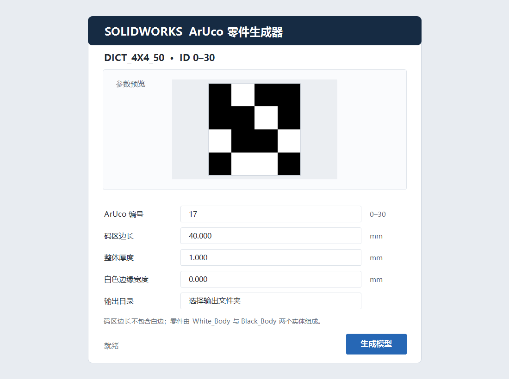
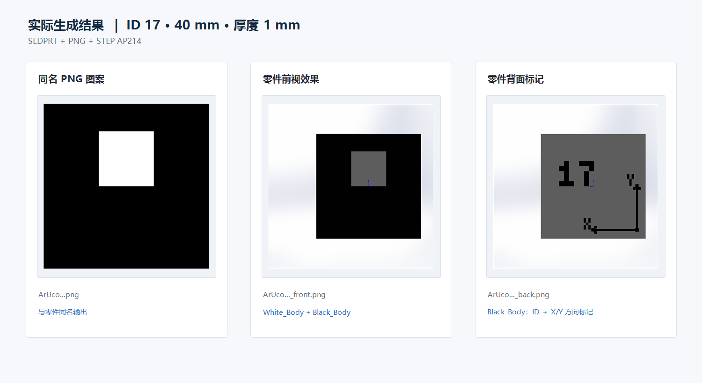
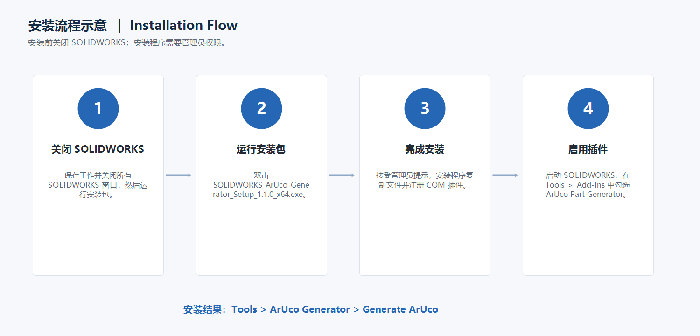
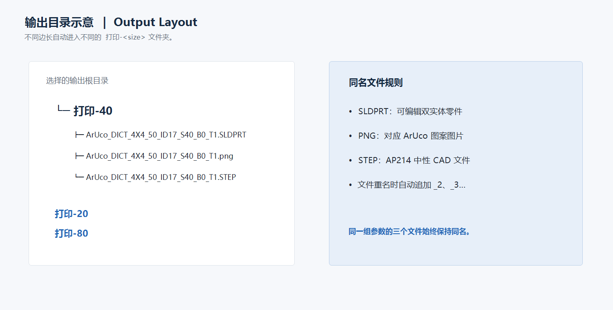

# SolidworksArucoGenerator

English | [简体中文](README.md)

A SOLIDWORKS add-in that generates editable ArUco marker parts. It uses the
OpenCV `DICT_4X4_50` dictionary and supports marker IDs `0-30`. Each run
produces a two-body SOLIDWORKS part, a matching PNG image, and a STEP AP214
file.

## Features

- Configurable marker ID, marker side length, total thickness, and white border;
- One continuous body for the white base and white pattern;
- A separate continuous body for black cells, the rear ID, and `+X/+Y` marks;
- SLDPRT, PNG, and STEP AP214 output;
- Automatic `打印-<size>` output folders grouped by marker side length;
- Existing files are preserved by adding `_2`, `_3`, and later suffixes.

## Compatibility

| Environment | Status |
|---|---|
| SOLIDWORKS 2025 x64 SP0.0 | Fully validated |
| Other SOLIDWORKS 2025 x64 service packs | Expected to work, not individually validated |
| SOLIDWORKS 2026 x64 | May work, not validated |
| SOLIDWORKS 2024 and earlier | Not guaranteed |
| 32-bit SOLIDWORKS | Not supported |
| Windows | Windows 10 1809 x64 or later |
| .NET | .NET Framework 4.8 |

The current build references the SOLIDWORKS 2025 Revision 33 interop
assemblies.

## Download and Verification

Installer:

[`dist/SOLIDWORKS_ArUco_Generator_Setup_1.1.0_x64.exe`](dist/SOLIDWORKS_ArUco_Generator_Setup_1.1.0_x64.exe)

SHA-256:

```text
29acd63bab28240197796c790c9d0f527403eeef4e0a11ca6c11f6774d1a5e99
```

The installer is not Authenticode-signed. Windows SmartScreen may show an
unknown-publisher warning.

## UI and Output Preview

UI preview:



Verified generation result (ID 17, 40 mm marker side, 1 mm thickness):



## Installation

1. Save your work and completely close all SOLIDWORKS windows.
2. Run `SOLIDWORKS_ArUco_Generator_Setup_1.1.0_x64.exe`.
3. Accept the Windows administrator prompt and finish installation.
4. Start SOLIDWORKS.
5. Open `Tools > Add-Ins` and verify that **ArUco Part Generator** is enabled.
6. Open the UI from `Tools > ArUco Generator > Generate ArUco`.

Installation flow:



Close SOLIDWORKS before uninstalling the add-in from Windows Installed Apps.

## Usage

| Parameter | Description |
|---|---|
| ArUco ID | `0-30` |
| Marker side | Default `20 mm`; excludes the optional white border |
| Total thickness | Default `1 mm` |
| White border | At least `0 mm`; default `0 mm` |
| Output directory | Root folder used to group results by marker size |

After clicking **Generate Model**, the add-in creates and opens the part. For
a 40 mm marker:

```text
selected output directory/
└─ 打印-40/
   ├─ ArUco_DICT_4X4_50_ID07_S40_B0_T1.SLDPRT
   ├─ ArUco_DICT_4X4_50_ID07_S40_B0_T1.png
   └─ ArUco_DICT_4X4_50_ID07_S40_B0_T1.STEP
```

STEP files are exported as AP214 with appearance data enabled. The add-in
restores the user's previous SOLIDWORKS STEP preferences after export.

Output directory layout:



## Building from Source

Prerequisites:

- SOLIDWORKS 2025 x64;
- .NET SDK 8;
- .NET Framework 4.8 Developer Pack;
- Inno Setup 7 x64 when building the installer.

Standard SOLIDWORKS installations are detected automatically. For a custom
installation, set:

```powershell
$env:SOLIDWORKS_INTEROP_PATH = "C:\path\to\solidworks\api\redist"
```

Build the add-in and validation host:

```powershell
.\ArucoSolidWorksAddin\scripts\Build.ps1
```

Build the installer:

```powershell
.\ArucoSolidWorksAddin\scripts\BuildInstaller.ps1
```

## Privacy and Security

The add-in has no network access, telemetry, account sign-in, or upload
functionality. Models and images are written only to the local directory
selected by the user. Before publication, the repository was scanned for
credentials, tokens, private keys, email addresses, local Windows usernames, and
machine-specific absolute paths. Build outputs, PDB files, logs, validation
samples, and local registry state are excluded.

See [PRIVACY.md](PRIVACY.md) and [SECURITY.md](SECURITY.md).

## License

No open-source license is currently granted. Publishing the source does not
automatically grant permission to copy, modify, or redistribute it.
